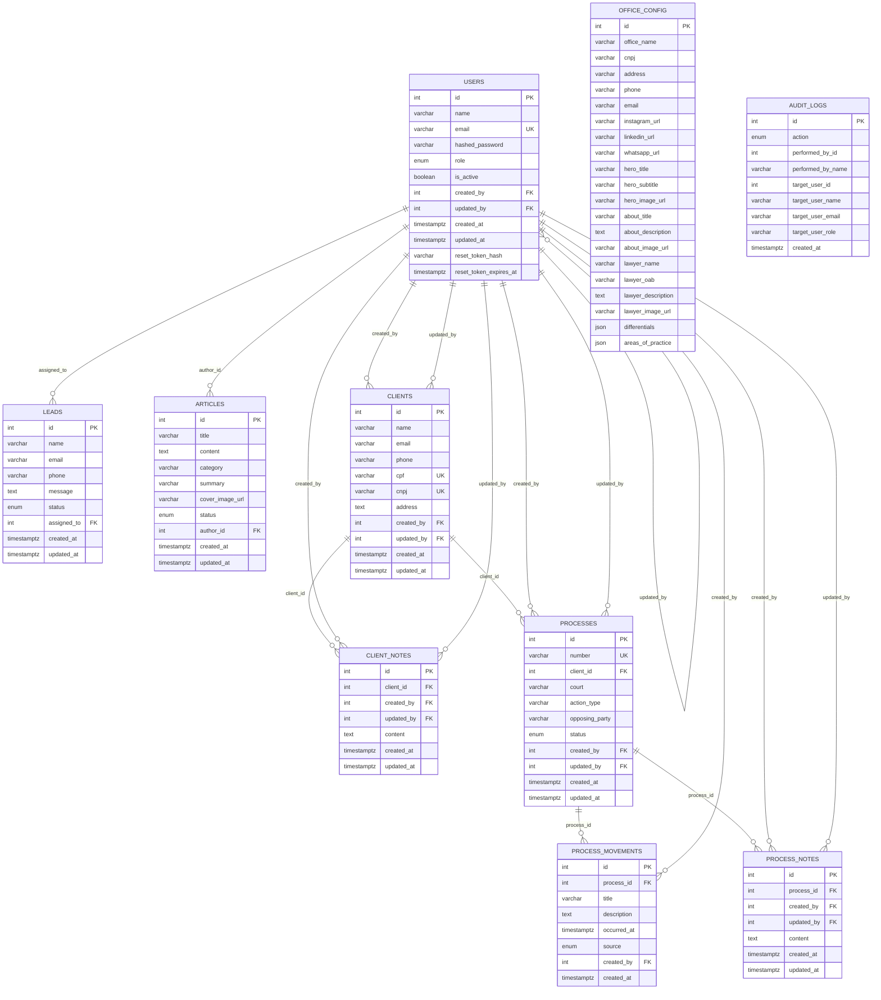

# Modelo Físico do Banco

O modelo físico abaixo representa as tabelas persistidas pelo backend atual. A base usa PostgreSQL em produção/local via Docker Compose e SQLAlchemy como ORM.

!!! info "Observação"
    O projeto ainda não possui migrations com Alembic. Hoje o schema é criado pela aplicação com `Base.metadata.create_all`. Este documento registra o modelo físico esperado a partir dos models SQLAlchemy atuais.

## Diagrama ER

## Tabelas

### `users`

| Coluna | Tipo | Restrições |
|---|---|---|
| `id` | integer | PK, index |
| `name` | varchar(255) | not null |
| `email` | varchar(255) | not null, unique, index |
| `hashed_password` | varchar(255) | not null |
| `role` | enum `ADMIN`/`USER` | not null, default `USER` |
| `is_active` | boolean | not null, default `true` |
| `created_by` | integer | FK `users.id`, nullable |
| `updated_by` | integer | FK `users.id`, nullable |
| `created_at` | timestamptz | not null, default `now()` |
| `updated_at` | timestamptz | not null, default `now()`, on update |
| `reset_token_hash` | varchar(64) | nullable |
| `reset_token_expires_at` | timestamptz | nullable |

### `leads`

| Coluna | Tipo | Restrições |
|---|---|---|
| `id` | integer | PK, index |
| `name` | varchar(120) | not null |
| `email` | varchar(255) | not null, index |
| `phone` | varchar(20) | nullable |
| `message` | text | nullable |
| `status` | enum `novo`/`em_atendimento`/`fechado`/`descartado` | not null, default `novo` |
| `assigned_to` | integer | FK `users.id`, on delete set null |
| `created_at` | timestamptz | not null, default `now()` |
| `updated_at` | timestamptz | not null, default `now()`, on update |

### `office_config`

| Coluna | Tipo | Restrições |
|---|---|---|
| `id` | integer | PK, index |
| `office_name`, `cnpj`, `phone`, `email` | varchar | nullable |
| `address` | varchar(500) | nullable |
| `instagram_url`, `linkedin_url`, `whatsapp_url` | varchar(500) | nullable |
| `hero_title`, `about_title`, `lawyer_name` | varchar(255) | nullable |
| `hero_subtitle` | varchar(1000) | nullable |
| `hero_image_url` | varchar(500) | nullable |
| `about_description`, `lawyer_description` | text | nullable |
| `about_image_url`, `lawyer_image_url` | varchar(5000) | nullable |
| `lawyer_oab` | varchar(50) | nullable |
| `differentials`, `areas_of_practice` | json | nullable |

### `articles`

| Coluna | Tipo | Restrições |
|---|---|---|
| `id` | integer | PK, index |
| `title` | varchar(255) | not null |
| `content` | text | not null |
| `category` | varchar(100) | not null |
| `summary` | varchar(500) | nullable |
| `cover_image_url` | varchar(500) | nullable |
| `status` | enum `draft`/`published` | not null, default `draft` |
| `author_id` | integer | FK `users.id`, not null |
| `created_at` | timestamptz | not null, default `now()` |
| `updated_at` | timestamptz | not null, default `now()`, on update |

### `clients`

| Coluna | Tipo | Restrições |
|---|---|---|
| `id` | integer | PK, index |
| `name` | varchar(120) | not null |
| `email` | varchar(255) | nullable |
| `phone` | varchar(20) | nullable |
| `cpf` | varchar(11) | unique, nullable, index |
| `cnpj` | varchar(14) | unique, nullable, index |
| `address` | text | nullable |
| `created_by` | integer | FK `users.id`, nullable |
| `updated_by` | integer | FK `users.id`, nullable |
| `created_at` | timestamptz | not null, default `now()` |
| `updated_at` | timestamptz | not null, default `now()`, on update |

### `client_notes`

| Coluna | Tipo | Restrições |
|---|---|---|
| `id` | integer | PK, index |
| `client_id` | integer | FK `clients.id`, not null, index, on delete cascade |
| `created_by` | integer | FK `users.id`, not null |
| `updated_by` | integer | FK `users.id`, nullable |
| `content` | text | not null |
| `created_at` | timestamptz | not null, default `now()` |
| `updated_at` | timestamptz | not null, default `now()`, on update |

### `processes`

| Coluna | Tipo | Restrições |
|---|---|---|
| `id` | integer | PK, index |
| `number` | varchar(20) | not null, unique, index |
| `client_id` | integer | FK `clients.id`, nullable, index, on delete restrict |
| `court` | varchar(120) | not null |
| `action_type` | varchar(120) | not null |
| `opposing_party` | varchar(255) | nullable |
| `status` | enum `ATIVO`/`SUSPENSO`/`ARQUIVADO`/`ENCERRADO` | not null, default `ATIVO` |
| `created_by` | integer | FK `users.id`, nullable |
| `updated_by` | integer | FK `users.id`, nullable |
| `created_at` | timestamptz | not null, default `now()` |
| `updated_at` | timestamptz | not null, default `now()`, on update |

### `process_movements`

| Coluna | Tipo | Restrições |
|---|---|---|
| `id` | integer | PK, index |
| `process_id` | integer | FK `processes.id`, not null, index, on delete cascade |
| `title` | varchar(150) | not null |
| `description` | text | nullable |
| `occurred_at` | timestamptz | not null, default `now()` |
| `source` | enum `MANUAL`/`SYSTEM` | not null, default `MANUAL` |
| `created_by` | integer | FK `users.id`, nullable |
| `created_at` | timestamptz | not null, default `now()` |

Indice composto: `ix_process_movements_process_occurred(process_id, occurred_at)`.

### `process_notes`

| Coluna | Tipo | Restrições |
|---|---|---|
| `id` | integer | PK, index |
| `process_id` | integer | FK `processes.id`, not null, index, on delete cascade |
| `created_by` | integer | FK `users.id`, not null |
| `updated_by` | integer | FK `users.id`, nullable |
| `content` | text | not null |
| `created_at` | timestamptz | not null, default `now()` |
| `updated_at` | timestamptz | not null, default `now()`, on update |

### `audit_logs`

| Coluna | Tipo | Restrições |
|---|---|---|
| `id` | integer | PK, index |
| `action` | enum `USER_CREATED`/`USER_DEACTIVATED` | not null |
| `performed_by_id` | integer | nullable |
| `performed_by_name` | varchar(255) | nullable |
| `target_user_id` | integer | not null |
| `target_user_name` | varchar(255) | not null |
| `target_user_email` | varchar(255) | not null |
| `target_user_role` | varchar(50) | not null |
| `created_at` | timestamptz | not null, default `now()` |

`audit_logs` guarda snapshots textuais da operação. Os campos `performed_by_id` e `target_user_id` não estão declarados como FK no model atual.

## Regras Físicas Relevantes

- `clients.cpf` e `clients.cnpj` são únicos, mas nullable.
- `processes.number` guarda o número CNJ normalizado como 20 dígitos.
- `process_movements` e `process_notes` são apagados em cascata quando o processo é removido.
- `client_notes` é apagado em cascata quando o cliente é removido.
- `processes.client_id` usa `ondelete="RESTRICT"`, impedindo remoção direta de cliente vinculado a processo.
- `leads.assigned_to` usa `ondelete="SET NULL"`.
